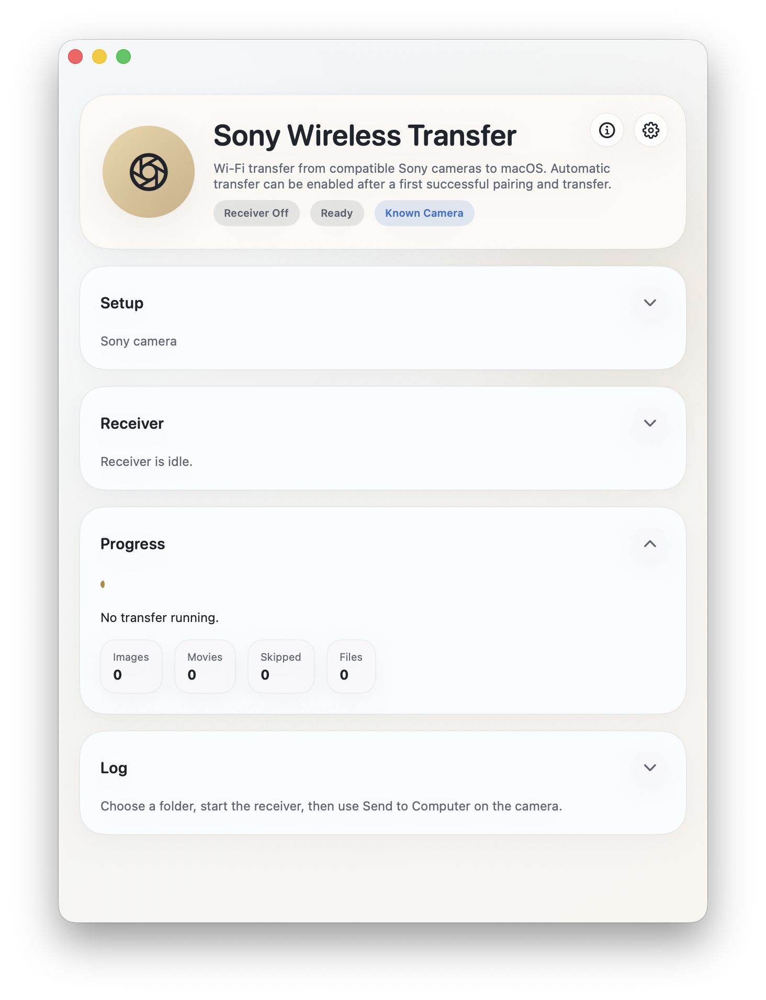

# Sony Wireless Transfer

<p align="center">
  
</p>

Sony Wireless Transfer is a native macOS app for Sony cameras that still support **Send to Computer** over Wi-Fi.

It has been tested with a Sony A6000 and should also work with other compatible Sony models, but those have not been verified yet.

## What It Does

- Transfers photos and movies from a Sony camera over Wi-Fi
- Remembers your camera after the first successful transfer
- Can automatically start a transfer when the known camera appears on your network
- Preserves the camera-reported capture timestamp on downloaded files when available
- Includes an optional USB pairing step for cameras that need the one-time Sony wireless registration
- Ships as a signed and notarized macOS app bundle and disk image

## Project Status

This repository contains:

- the main macOS app
- the optional USB pairing helper source
- a build script for the macOS `.app` and `.dmg`

The main app code uses Apple system frameworks only.

## Build macOS From Source

Run the app directly:

```bash
HOME=$PWD/.build/swiftpm-home \
CLANG_MODULE_CACHE_PATH=$PWD/.build/ModuleCache \
SWIFTPM_MODULECACHE_OVERRIDE=$PWD/.build/ModuleCache \
swift run --disable-sandbox SonyWirelessMacOS
```

Create a packaged app and disk image:

```bash
chmod +x scripts/build_app.sh
zsh scripts/build_app.sh
```

That produces:

```text
dist/Sony Wireless Transfer.app
dist/Sony Wireless Transfer.dmg
```

## Build Notes

- The Wi-Fi transfer app itself does not need third-party Swift packages.
- The optional USB pairing helper uses `libusb`.
- If `libusb` is available locally, `scripts/build_app.sh` builds the helper from source and bundles the required notices.
- If `libusb` is not available, the app can still be built, but the USB pairing feature will be unavailable in the packaged app.

## License

The original project code is released under the [MIT License](LICENSE).

There is one important exception:

- the optional USB pairing helper in `sony-guid-setter.c` is derived from earlier third-party work and is documented separately
- `libusb` is also bundled only for that helper path

See [THIRD_PARTY_NOTICES.md](THIRD_PARTY_NOTICES.md) for the exact split.

## Third-Party Notice

This project intentionally keeps third-party code to a minimum.

At the time of writing, the only third-party-derived component is the optional USB pairing helper. The core Wi-Fi transfer app is separate from that helper.
